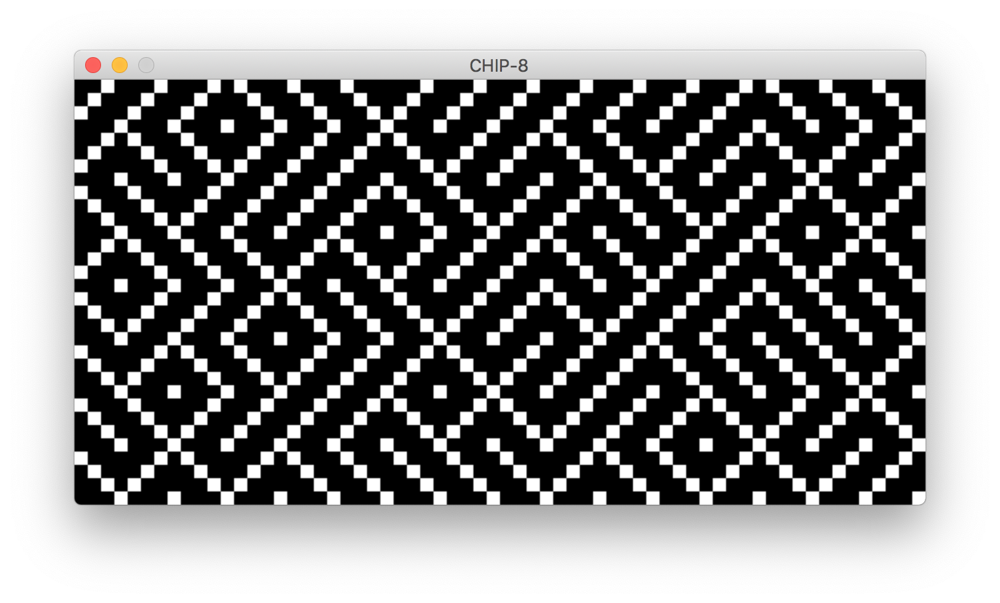
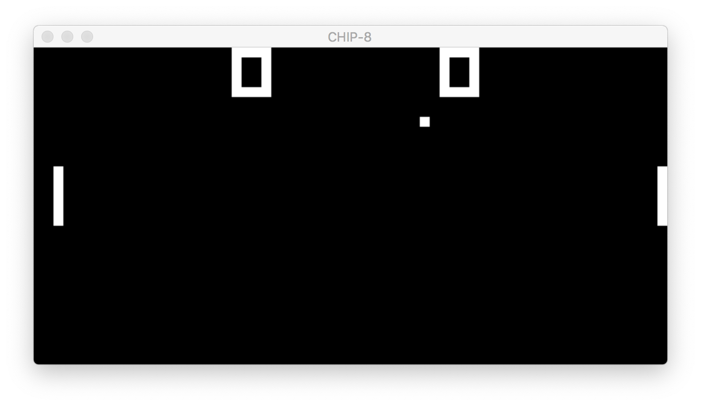
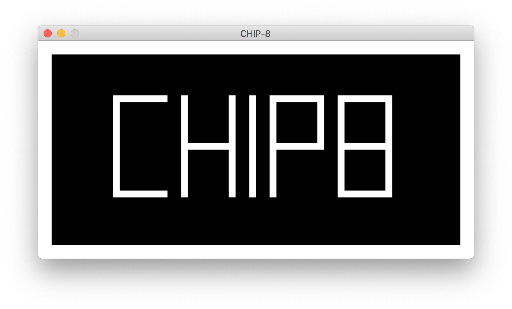

# [Chip-8](https://en.wikipedia.org/wiki/CHIP-8)

This is an implementation of CHIP-8 virtual machine, written in Rust, based on [this specification](http://devernay.free.fr/hacks/chip8/C8TECH10.HTM).

⚠️Not all opcodes are implemented,  only enought for running  programs PONG, MAZE, and PICTURE.

Using [rust-sdl2](https://github.com/Rust-SDL2/rust-sdl2) for graphics and keyboard input.

#### Screenshots
##### Maze

##### Pong

##### Picture

#### To do
- [ ] All opcodes
- [x] Video Driver
- [x] Input Driver
- [ ] Sound Driver

#### License
MIT
